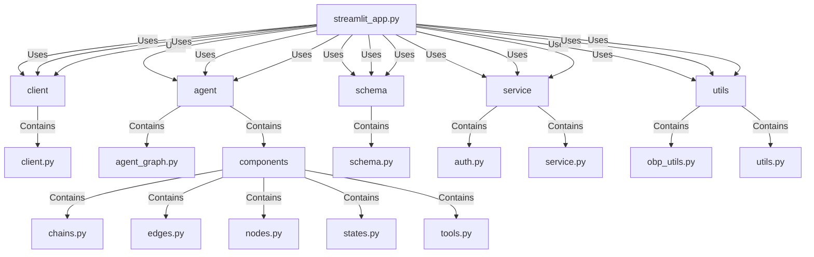

# Application Architecture

## How the App Works

1. **Installation**:
   - The app uses `poetry` for dependency management. Install `poetry` and run `poetry install` to set up the environment.
   - Create a `data` folder in the `src` directory for the ChromaDB database.

2. **Environment Setup**:
   - Rename `.env.example` to `.env` and configure it with the necessary parameters.
   - Choose an LLM provider (OpenAI, Anthropic, or Ollama) and set the corresponding API keys and model names in the `.env` file.

3. **Open Bank Project (OBP) Credentials**:
   - Obtain OBP credentials and set them in the `.env` file to allow the agent to communicate with the OBP API.

4. **Running the App**:
   - Activate the poetry virtual environment using `poetry shell`.
   - Run the backend agent with `python src/run_service.py`.
   - In a separate terminal, run the frontend Streamlit app with `streamlit run src/streamlit_app.py`.

5. **Langchain Tracing**:
   - Optionally, set up Langchain tracing with Langsmith by obtaining a Langchain tracing API key and configuring it in the `.env` file.

## Using Langchain Tracing as Audit Logs

Langchain tracing can indeed act as audit logs to some extent. It provides detailed traces of the execution flow, including the sequence of API calls, intermediate results, and final outputs. This can be useful for auditing purposes, as it allows you to track the actions taken by the language models and agents, and understand how they arrived at their responses.

### Benefits of Using Langchain Tracing as Audit Logs

1. **Detailed Execution Traces**:
   - Langchain tracing captures detailed information about the execution flow, which can be used to audit the actions taken by the models and agents.

2. **Metrics Collection**:
   - The collected metrics, such as response times and token usage, can provide additional context for auditing purposes.

3. **Integration with Langsmith**:
   - Langsmith provides a platform for managing and monitoring the collected traces and metrics, making it easier to review and analyze the audit logs.

### Limitations

1. **Scope**:
   - While Langchain tracing provides detailed execution traces, it may not capture all the information required for comprehensive audit logs, such as user actions or system-level events.

2. **Customization**:
   - Depending on your auditing requirements, you may need to customize the tracing setup to capture additional information or integrate with other logging systems.

### Setting Up Langchain Tracing for Auditing

To set up Langchain tracing for auditing purposes, follow the steps outlined in the previous section on setting up Langchain tracing. Additionally, consider the following:

1. **Customize Tracing**:
   - Customize the tracing setup to capture any additional information required for auditing purposes. This may involve modifying the application code to include additional context in the traces.

2. **Integrate with Other Logging Systems**:
   - If necessary, integrate Langchain tracing with other logging systems to provide a more comprehensive audit trail.

## Langchain Tracing

Langchain tracing is a feature provided by Langsmith that allows developers to collect metrics and trace the execution of their language models and agents. This can be useful for debugging, performance monitoring, and understanding the behavior of the models in production.

1. **Metrics Collection**:
   - Langchain tracing collects various metrics related to the execution of language models, such as response times, token usage, and error rates.
   - These metrics can help developers identify performance bottlenecks and optimize their models.

2. **Execution Tracing**:
   - Langchain tracing provides detailed traces of the execution flow, including the sequence of API calls, intermediate results, and final outputs.
   - This can be useful for debugging complex interactions and understanding how the models arrive at their responses.

3. **Integration with Langsmith**:
   - Langchain tracing integrates with Langsmith, a platform for managing and monitoring language models.
   - Developers can use Langsmith to visualize the collected metrics and traces, set up alerts, and generate reports.

### Setting Up Langchain Tracing

To set up Langchain tracing in the application, follow these steps:

1. **Obtain a Langchain Tracing API Key**:
   - Sign up for Langsmith and obtain a Langchain tracing API key.

2. **Configure the Environment**:
   - Set the following environment variables in the `.env` file:
     ```
     LANGCHAIN_TRACING_V2="true"
     LANGCHAIN_API_KEY="lsv2_pt_..."
     LANGCHAIN_PROJECT="langchain-opey" # or whatever name you want
     ```

3. **Enable Tracing in the Code**:
   - Ensure that the application code is configured to use Langchain tracing. This may involve importing the necessary modules and initializing the tracing client.

## External APIs

1. **OpenAI API**: Used for language model services if OpenAI is chosen as the model provider.
2. **Anthropic API**: Used for language model services if Anthropic is chosen as the model provider.
3. **Ollama API**: Used for running models locally if Ollama is chosen as the model provider.
4. **Open Bank Project (OBP) API**: Used for accessing banking data and services.
5. **Langchain API**: Used for tracing and metrics if Langchain tracing is enabled.

## Open Banking APIs

The Open Bank Project (OBP) provides a set of APIs that allow developers to access banking data and services. These APIs are designed to be secure, standardized, and easy to use. Here are some key aspects of the OBP APIs:

1. **Authentication**:
   - The OBP APIs use OAuth 1.0a for authentication. Developers need to obtain an API key, consumer key, and user credentials to access the APIs.
   - The `auth.py` file in the project contains a function to sign JWTs, which may be used for secure communication with the OBP APIs.

2. **Account Information**:
   - The OBP APIs provide endpoints to retrieve account information, including account balances, transactions, and account details.
   - Example endpoints:
     - `GET /obp/v4.0.0/my/accounts` - Retrieve a list of accounts for the authenticated user.
     - `GET /obp/v4.0.0/my/accounts/{account_id}/transactions` - Retrieve transactions for a specific account.

3. **Payments**:
   - The OBP APIs allow developers to initiate and manage payments. This includes creating payment orders, executing payments, and checking payment statuses.
   - Example endpoints:
     - `POST /obp/v4.0.0/banks/{bank_id}/accounts/{account_id}/payments` - Create a new payment order.
     - `GET /obp/v4.0.0/banks/{bank_id}/accounts/{account_id}/payments/{payment_id}` - Retrieve the status of a specific payment.

4. **Metadata**:
   - The OBP APIs provide endpoints to manage metadata associated with banking data. This includes adding tags, comments, and images to transactions and accounts.
   - Example endpoints:
     - `POST /obp/v4.0.0/banks/{bank_id}/accounts/{account_id}/transactions/{transaction_id}/metadata/tags` - Add tags to a transaction.
     - `POST /obp/v4.0.0/banks/{bank_id}/accounts/{account_id}/metadata/comments` - Add comments to an account.

5. **Customer Information**:
   - The OBP APIs allow developers to access customer information, including customer details and KYC (Know Your Customer) data.
   - Example endpoints:
     - `GET /obp/v4.0.0/customers` - Retrieve a list of customers.
     - `GET /obp/v4.0.0/customers/{customer_id}` - Retrieve details of a specific customer.

These APIs enable developers to build applications that can interact with banking data in a secure and standardized manner. The OBP APIs are designed to be flexible and extensible, allowing developers to create a wide range of banking applications.


