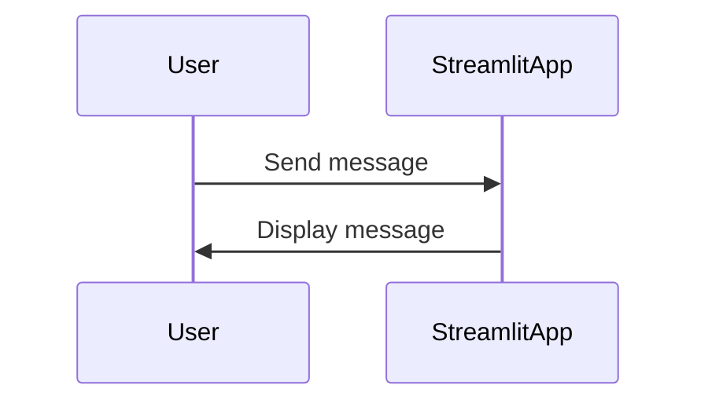
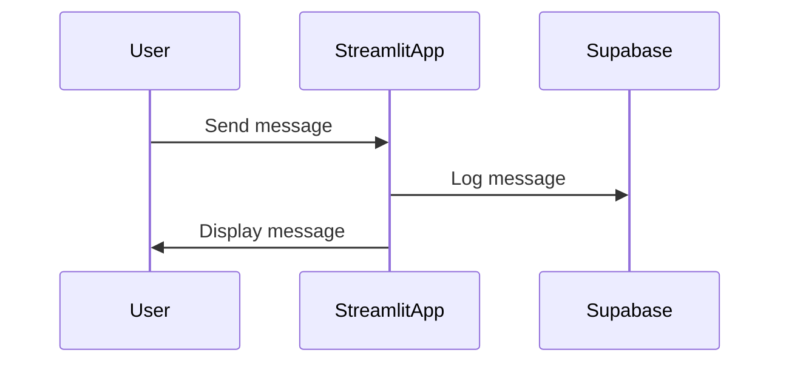

# Chat Log Feature

## Overview

The chat log feature logs chat messages to a Supabase database. It ensures that no Personally Identifiable Information (PII) is logged.

## Setup

1. Create a Supabase project and obtain the API URL and API key.
2. Create a table named `chat_logs` with the following columns:
   - `id` (UUID, primary key)
   - `timestamp` (timestamp)
   - `message` (text)

## Configuration

Set the following environment variables in your `.env` file:
```
SUPABASE_URL="your-supabase-url"
SUPABASE_KEY="your-supabase-key"
```

## Usage

Import the `log_chat_message` function and use it to log chat messages:

```python
from utils.chat_log import log_chat_message

log_chat_message("Hello, world!")
```

## Sanitization

The `sanitize_message` function is used to remove PII from chat messages. Implement the PII removal logic in this function.

## Sequence Diagram

### Before Implementation


### After Implementation

